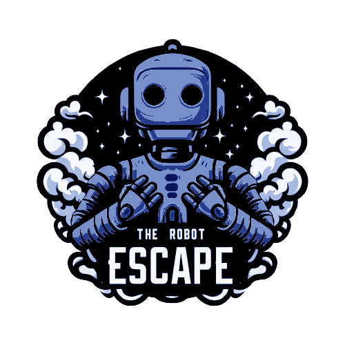

# The Robot Escape :robot:

This project has been created by [Rodrigo Micó Pliego](https://github.com/GoldsolacePVG "Rodrigo Micó Pliego") as a first project for the subject Videogame Design. The Robot Escape is a videogame of the gender "Infinite Runner", that consist on running throughout a map. In the particular case of this game, the main objective is to obtain the 18 coins around the map.

------------

  

 
